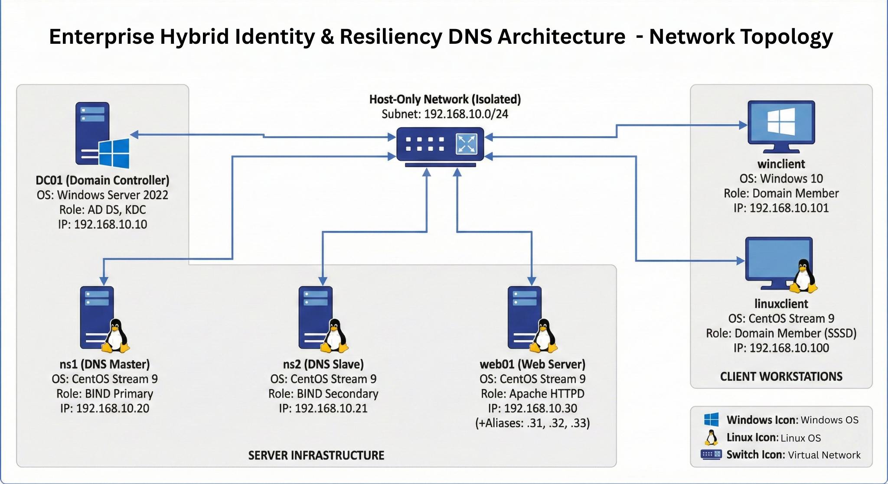

# Enterprise Hybrid Identity & Resilient DNS Architecture

    

## 📌 Executive Summary
This project simulates a real-world enterprise network environment integrating Windows and Linux ecosystems. The infrastructure was designed to prioritize **High Availability (HA)**, **Centralized Identity Management**, and **Service Isolation**.

The core objective was to build a robust Active Directory (AD DS) environment where cross-platform clients (Windows 10/11 & CentOS) authenticate centrally via Kerberos/SSSD, while relying on a fault-tolerant external BIND DNS infrastructure completely separate from Microsoft DNS.

## 🏗 System Architecture

The architecture consists of **6 Virtual Machines** operating on a strictly isolated Host-Only network (`192.168.10.0/24`) to simulate a secure internal LAN.

| Node Role | OS | IP Address | Service Function |
| :--- | :--- | :--- | :--- |
| **Domain Controller** | Win Server 2022 | `192.168.10.10` | AD DS, Kerberos KDC, LDAP |
| **DNS Master** | CentOS Stream 9 | `192.168.10.20` | BIND9 Authoritative Primary |
| **DNS Slave** | CentOS Stream 9 | `192.168.10.21` | BIND9 Authoritative Secondary |
| **Web Server** | CentOS Stream 9 | `192.168.10.30` | Apache HTTPD, IP & Name-based VHosts |
| **Win Client** | Windows 10 | `192.168.10.101` | Domain Member, End-user Simulation |
| **Linux Client** | CentOS Stream 9 | `192.168.10.100` | Domain Member (SSSD), End-user Simulation |

---

## Network Topology Diagram

<p align="center">
  
</p>

---

## 🛡️ Key Implementations

### 1. High-Availability DNS Infrastructure
* **Split-Horizon Deployment:** Decoupled DNS from the Domain Controller to use BIND9 as the authoritative source.
* **Redundancy:** Configured Master/Slave replication ensuring 100% uptime during maintenance windows.
* **Security:** Implemented **TSIG Key Authentication** (HMAC-SHA256) to secure zone transfers between Master and Slave, preventing unauthorized zone poisoning or snooping.

### 2. Cross-Platform Identity Management (IdM)
* **Active Directory Integration:** Deployed a `CORP.EXAMPLE.LOCAL` forest.
* **Linux Integration:** Hardened Linux clients joined to AD using `realmd`, `SSSD`, and `Kerberos`.
* **Verification:** Validated seamless login for AD users (`student1`) on Linux terminals with proper UID/GID mapping.

### 3. Secure Web Hosting
* **Virtual Hosting:** Configured Apache to serve 6 distinct sites using both **Name-Based** (shared IP) and **IP-Based** (dedicated network alias) techniques.
* **SSL/TLS:** Implemented self-signed certificates to simulate HTTPS encryption for critical application endpoints.
* **Access Control:** Directory-level permission hardening to prevent unauthorized traversal.

---

## 🔐 Security Controls Applied
* **Firewalling (firewalld):** Implemented "Least Privilege" network access. Ports (53, 80, 443, 88) were explicitly allowed only on relevant nodes.
* **NTP Synchronization:** Configured `chrony` across all nodes to ensure Kerberos ticket validity and prevent replay attacks.
* **TSIG Authentication:** Secured DNS zone transfers using HMAC-SHA256 keys.
* **Network Isolation:** Removed NAT adapters post-configuration to strictly air-gap the environment.

---

## 🛠️ Detailed Technical Implementation & Evidence

### 1. DNS Master Server (`ns1.example.local`)
**Role:** Authoritative Primary DNS independent of Microsoft DNS. <br>
**OS:** CentOS Stream 9 <br>
**IP:** `192.168.10.20`

The Master DNS server provides name resolution for the internal domain and facilitates AD service discovery.

* **Network Configuration:** Configured with a static IP and loopback for local resolution.
    * **Evidence 1:** [📸 Network Interface Configuration](evidence/Master%20DNS%201.0.png)
* **Forward & Reverse Zones:** Configured `example.local` for web services and `corp.example.local` with essential SRV records (`_ldap`, `_kerberos`) for Active Directory integration.
    * **Evidence 2:** [📸 Example.local Zone File](evidence/Master%20DNS%201.1.png)
    * **Evidence 3:** [📸  Corp.example.local Zone File](evidence/Master%20DNS%201.2.png)
    * **Evidence 4:** [📸  Reverse Zone File](evidence/Master%20DNS%201.3.png)
* **Security (TSIG):** Implemented `hmac-sha256` TSIG keys to secure zone transfers, ensuring only the authenticated Slave can replicate data.
    * **Evidence 5:** [📸  Named.conf & TSIG Keys](evidence/Master%20DNS%201.4.png)
* **Verification:** Validated local resolution and service status via `nslookup`.
    * **Evidence 6:** [📸  Resolution Test](evidence/Master%20DNS%201.5.png)

### 2. DNS Slave Server (`ns2.example.local`)
**Role:** Redundant Secondary DNS for High Availability (HA). <br>
**OS:** CentOS Stream 9 <br>
**IP:** `192.168.10.21`

The Slave DNS server ensures network resilience. It is configured to automatically replicate all zone data from the Master server, allowing it to seamlessly handle client queries if the Master node goes offline.

* **Network Configuration:** The server is assigned the static IP `192.168.10.21`. The network adapter is configured to use the Master DNS (`192.168.10.20`) as its primary resolver to facilitate initial connectivity.
    * **Evidence 1:** [📸 Network Interface Configuration](evidence/Slave%20DNS%201.0.png)
* **BIND9 Slave Configuration:** Configured `named.conf` with `type slave` zones pointing to the Master (`192.168.10.20`). Included the `/etc/named/tsig.key` file to authenticate secure updates.
    * **Evidence 2:** [📸 Slave Named.conf Configuration](evidence/Slave%20DNS%201.1.png)
* **Zone Transfer Verification:** Upon startup, the server authenticated via TSIG and triggered a full zone transfer (AXFR). Verification of the `/var/named/slaves/` directory confirmed automatic file creation.
    * **Evidence 3:** [📸 Zone Transfer Proof & Lookup Test](evidence/Slave%20DNS%201.2.png)


### 3. Web Server (`web01.example.local`)
**Role:** Enterprise Application Hosting (Apache HTTPD). <br>
**OS:** CentOS Stream 9 <br>
**IPs:** `192.168.10.30`, `.31`, `.32`, `.33`.

This server hosts multiple virtual websites using distinct configurations to demonstrate advanced Apache capabilities.

* **Multi-Interface Networking:** To support IP-based hosting, the server utilizes **4 distinct network interfaces** (`ens160`, `ens224`, `ens256`, `ens161`), each bound to a dedicated static IP.
    * **Evidence 1:** [📸 Multi-Interface Network Config](evidence/Web%20Server%201.2.png)

* **Virtual Host Configuration:**
    * **Name-Based Hosts:** Three distinct sites (`site1`, `site2`, `site3`) are hosted on the primary IP `192.168.10.30`, differentiated by the `Host` header.
        * **Evidence 2:** [📸 Name-Based VHost Config](evidence/Web%20Server%201.0.png)
    * **IP-Based Hosts:** Three application sites (`app1`, `app2`, `app3`) are bound to dedicated IPs (`.31`, `.32`, `.33`) for traffic isolation.
    * **Secure SSL/TLS:** `App3` is configured with OpenSSL certificates to serve traffic over HTTPS (Port 443).
        * **Evidence 3:** [📸 IP-Based & SSL VHost Config](evidence/Web%20Server%201.1.png)

* **Browser Verification:**
    * **Site 1 (Name-Based):** Validated generic intranet portal access.
        * **Evidence 4:** [📸 Site 1 Browser Test](evidence/Web%20Server%201.3.png)
    * **App 1 (IP-Based):** Validated dedicated application hosting on `192.168.10.31`.
        * **Evidence 5:** [📸 App 1 Browser Test](evidence/Web%20Server%201.4.png)
    * **App 3 (Secure):** Validated HTTPS connectivity showing the secure lock icon on the dedicated host `192.168.10.33`.
        * **Evidence 6:** [📸 App 3 SSL Browser Test](evidence/Web%20Server%201.5.png)

### 4. Domain Controller (`dc01.corp.example.local`)
**Role:** Centralized Identity Authority. <br>
**OS:** Windows Server 2022 <br>
**IP:** `192.168.10.10`

* **Network & DNS Strategy:** The Domain Controller was manually configured to bypass the default Microsoft DNS service. Instead, its network adapter points explicitly to the external BIND servers (`192.168.10.20` / `.21`) for all resolution needs, ensuring strict separation of duties.
    * **Evidence 1:** [📸 IP & DNS Configuration (ipconfig)](evidence/Win%20Server%201.0.png)

* **Object Management:** A structured AD hierarchy was implemented, featuring a dedicated "Workstations" Organizational Unit (OU) and user accounts (`Student1`, `Student2`) for testing authentication.
    * **Evidence 2:** [📸 Active Directory Users & Computers](evidence/Win%20Server%201.2.pmg)

* **BIND Integration Verification:** Verified that the Windows Server correctly resolves internal hostnames and reverse lookups via the Linux BIND server, confirming the successful integration of the hybrid environment.
    * **Evidence 3:** [📸 Nslookup Verification](evidence/Win%20Server%201.1.png)

### 5. Windows Client (`winclient`)
**Role:** Standard Corporate Desktop. <br>
**OS:** Windows 10 Pro <br>
**IP:** `192.168.10.101`

* **Network Strategy:** Configured via static addressing to utilize the BIND Master/Slave DNS pair (`192.168.10.20`, `.21`), ensuring total independence from the DC's internal DNS.
    * **Evidence 1:** [📸 IP & DNS Configuration](evidence/Win%20Client%201.2.png)

* **Domain Integration & Identity:** Successfully joined the `CORP.EXAMPLE.LOCAL` domain. Validated `Kerberos` authentication by logging in as the domain user `CORP\student1`.
    * **Evidence 2:** [📸 System Status & Whoami Verification](evidence/Win%20Client%201.0.png)

* **Service Consumption:** Validated the client's ability to resolve custom internal DNS records and access secure HTTPS resources hosted on the Linux Web Server.
    * **Evidence 3:** [📸 Secure Web Access Test](evidence/Win%20Client%201.1.png)

### 6. Linux Client (`linuxclient`)
**Role:** RHEL/CentOS Workstation. <br>
**IP:** `192.168.10.100`

* **Active Directory Integration (Realmd & SSSD):**
    * The client was joined to the `CORP.EXAMPLE.LOCAL` domain using `realm join`.
    * **Validation:** The `realm list` command confirms the client is a `kerberos-member` of the domain, managed by `sssd`.
    * **Evidence 1:** [📸 Realm List Output](evidence/Linux%20Client%201.1.png)

* **Identity Mapping & Authentication:**
    * **User Recognition:** The `id student1@corp.example.local` command successfully retrieves the user's UID and GID from the Active Directory controller, proving the identity provider integration works.
    * **Kerberos Ticket Granting:** Using `kinit`, a Ticket Granting Ticket (TGT) was successfully requested from the KDC (`dc01`). The `klist` command confirms the ticket cache is valid.
    * **Evidence 2:** [📸 ID Mapping & Kerberos Ticket (klist)](evidence/Linux%20Client%201.2.png)

* **Network & DNS Verification:**
    * **Interface Config:** The `ens160` interface is configured with the static IP `192.168.10.100`.
        * **Evidence 3:** [📸 IP Configuration](evidence/Linux%20Client%201.0.png)
    * **Resolver Verification:** The `nslookup` tests confirm that the client can resolve internal hostnames (`site1.example.local`) using the Master DNS (`10.20`).
    * **Failover Proof:** A secondary query successfully resolves via the Slave DNS (`10.21`), validating client-side redundancy.
        * **Evidence 4:** [📸 DNS Resolution & Failover Test](evidence/Linux%20Client%201.3.png)
    * **Reverse DNS:** The `dig -x` command confirms the client can perform reverse lookups (PTR) against the Domain Controller's IP.
        * **Evidence 5:** [📸 Reverse Lookup (Dig)](evidence/Linux%20Client%201.4.png)

---

## 📂 Configuration & Codebase Navigation

This repository is organized by service role. Click the file names below to view the sanitized configuration code used in this project.

### **1. Infrastructure Services (DNS & Web)**

| Component | File Name | Description | 
| :--- | :--- | :--- |
| **DNS Master** | [**named.conf**](configs/dns-master%20/named.conf) | Primary BIND9 configuration including TSIG keys and ACLs. |
| | [**for.example.local.zone**](configs/dns-master%20/for.example.local.zone) | Forward zone defining A records for web infrastructure. |
| | [**for.corp.example.local.zone**](configs/dns-master%20/for.corp.example.local.zone) | AD-integrated zone containing SRV records for DC discovery. |
| | [**reverse.zone**](configs/dns-master%20/reverse.zone) | Reverse lookup zone (PTR records) for the `192.168.10.0/24` subnet. |
| **DNS Slave** | [**named.conf**](configs/dns-slave%20/named.conf) | Secondary BIND9 config setup for automatic zone replication. |
| **Web Server** | [**vhost.conf**](configs/web-server/vhost.conf) | Apache Virtual Host definitions for Name-Based and IP-Based sites. |

### **2. Identity Management (Linux Client)**

| Component | File Name | Description |
| :--- | :--- | :--- |
| **Kerberos** | [**krb5.conf**](configs/linux-client%20/krb5.conf) | Realm configuration mapping the Linux client to the Windows KDC. |
| **SSSD** | [**sssd.conf**](configs/linux-client%20/sssd.conf) | System Security Services Daemon config for AD authentication. |

### **3. Automation Scripts**

| Script Name | Path | Utility |
| :--- | :--- | :--- |
| **DNS Master Setup** | [**setup_dns_master.sh**](scripts/setup_dns_master.sh) | Bash script to automate BIND installation, zone creation, and firewall rules. |
| **Web Server Setup** | [**setup_web.sh**](scripts/setup_web.sh) | Bash script to deploy Apache, generate SSL certs, and configure VHosts. |


---

## 📂 Repository Structure
```text
│
├── README.md                <-- Project documentation
├──/configs
|   ├── /dns-master          <-- BIND9 Master Configurations
|   │   ├── named.conf
|   │   ├── for.example.local.zone
|   │   ├── for.corp.example.local.zone
|   │   └── reverse.zone
|   ├── /dns-slave           <-- BIND9 Slave Configurations
|   │   └── named.conf
|   ├── /web-server          <-- Apache HTTPD Virtual Hosts
|   │   └── vhost.conf
|   └── /linux-client        <-- Identity Management Configs
|       ├── krb5.conf
|       └── sssd.conf
│
├── /scripts                 <-- Setup commands as .sh files
│   ├── setup_dns_master.sh
│   └── setup_web.sh
│
└── /evidence                <-- Screenshots of verification steps
    ├── network-diagram.png
    ├── ad-structure.png
    ├── dns-failover-proof.png
    └── ...
